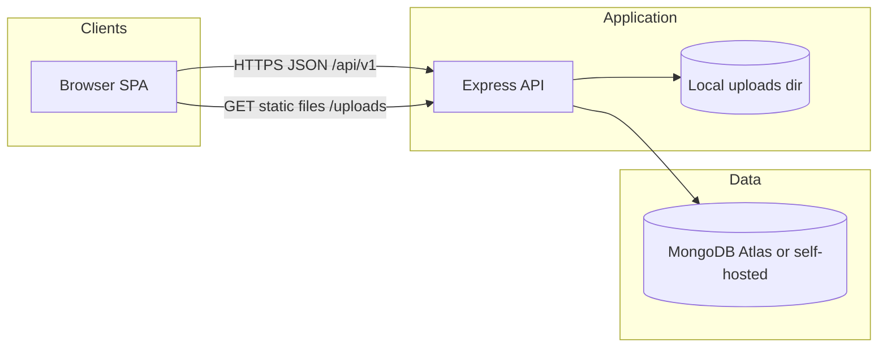

# System architecture

## Context

Mini Case Tracker is a **three-tier-style** deployment: SPA client → REST API → MongoDB, with optional static file reads for uploads.

**Actors:**

- **End users**: Managers and Agents using the React frontend (or tools such as Swagger / Postman).
- **MongoDB**: System of record for users, cases, comments, documents metadata, audit log.
- **File system**: Stored bytes for uploads; filenames are unpredictable (timestamp + entropy) while original names kept in metadata.

---

## Logical deployment (reference)

Suggested split per take-home submission guidance:

| Layer | Typical host |
|-------|----------------|
| Frontend | Static host (e.g. Vercel / Netlify) serving Vite build |
| Backend | Node host (e.g. Render / Railway / Fly.io) running `npm start` |
| Database | MongoDB Atlas (free tier acceptable) |

**Configuration coupling:**

- `CORS_ORIGIN` must include the SPA origin(s).
- `JWT_SECRET`, `MONGODB_URI`, and upload directory must align with persistent volume semantics if uploads must survive redeployments (often they do not on ephemeral disks without attached storage).

---

## Runtime components — backend (`backend/src`)

| Component | Responsibility |
|-----------|----------------|
| **`server.ts`** | HTTP listen, graceful DB connection lifecycle |
| **`app.ts`** | Express app wiring: helmet, CORS, body parsers, static `/uploads`, Swagger UI, mounting `/api/v1`, centralized errors |
| **Routes (`routes/`)** | Versioned routers: `auth`, `users`, `cases`, nested `comments`, `documents` |
| **Controllers** | Thin HTTP adapters: parse validated input, delegate to services, shape `ApiResponse` |
| **Services** | Business rules: status transitions, access control, aggregates, auditing side effects |
| **Models** | Mongoose schemas, indexes |
| **Middleware** | Auth (JWT), role gate, request validation (Zod), Multer uploads, unified error mapper |
| **Utils** | `ApiResponse`, `ApiError`, status transition assertions, JWT helpers |

---

## Frontend (summary)

React + TypeScript SPA (Vite) consuming the REST API:

- **State**: Redux Toolkit with persistence for auth, theme, table filters where applicable.
- **HTTP**: Axios with JWT attachment and global auth failure handling (`auth:logout` pattern).
- **Routing**: Protected routes vs public auth routes; Manager-only flows for create/list agents.

Detailed UI structure stays in **`frontend/README.md`**; backend HLD cares that the client conforms to envelopes and Bearer auth documented in [05](./05-api-and-integration.md).

---

## Integrations & external boundaries

| Boundary | Direction | Notes |
|---------|-----------|--------|
| MongoDB | App → Cluster | Requires valid `mongodb` / `mongodb+srv` URI for Mongoose |
| Browser download of files | App → Browser | Served from `/uploads/<filename>`; requires correct base URL behind reverse proxy |
| Email (password reset) | Optional | Implementation may omit real SMTP in dev; UX may surface token URL in controlled environments |

---

## Failure & availability (high level)

| Concern | Mitigation strategy |
|---------|---------------------|
| API process crash | Process manager restart (PM2, platform auto-restart) |
| MongoDB outage | Explicit connection errors bubbled via error middleware (`ApiError`-style envelopes) |
| Disk full / upload failure | Multer/`fs` failures surface as 400/500 depending on validation vs IO |
| CORS misconfiguration | Central `cors` options in `app.ts`; must match deployed frontend |

This document stays non-prescriptive about specific cloud SLAs and autoscaling patterns.
