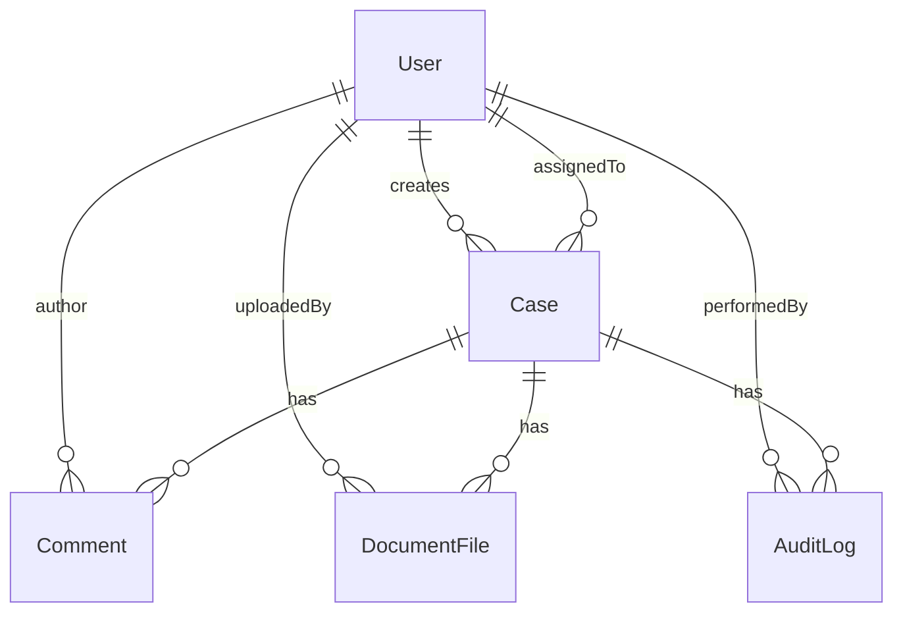

# Data model & domain

## Entity relationship (conceptual)

| Entity | Stores |
|--------|--------|
| **User** | Identity (`name`, `email`, bcrypt `password`, `role`, `isActive`), optional forgotten-password token fields |
| **Case** | Client/subject/type/due dates, **`status`**, **`assignedTo`**, **`createdBy`**, timestamps for submit/review |
| **Comment** | `caseId`, `author`, textual `body` (max length enforced), timestamps |
| **Document** (`DocumentFile` model name) | `caseId`, `uploadedBy`, original + stored filenames, MIME, size, filesystem `path` |
| **AuditLog** | Append-style events: **`status_change`**, **`case_created`**, **`document_uploaded`**, **`case_reassigned`**, etc. |

Indexes of note (MongoDB):

- **Case**: compound `{ status, assignedTo }` for filtering lists; **text index** on `clientName`, `subjectName`, `caseType` for search UX.
- **AuditLog**: `{ caseId, createdAt descending }` for timeline reads.
- **Comment**: `{ caseId, createdAt descending }`.
- **User**: unique `email`.

---

## Enumerations

### `User.role`

| Value | Label |
|-------|-------|
| `manager` | Manager |
| `agent` | Agent |

### `Case.status`

| Value | Typical meaning |
|-------|----------------|
| `new` | Created, not necessarily assigned yet |
| `assigned` | Work queue item for a specific agent |
| `in_progress` | Agent actively working |
| `submitted` | Agent finished; awaits manager adjudication |
| `cleared` | Terminal positive outcome |
| `discrepant` | Terminal negative / issues outcome |

---

## State machine (server-enforced)

Allowed transitions (**from → to**) and actor:

| Current | Next | Role |
|---------|------|------|
| `new` | `assigned` | Manager |
| `assigned` | `in_progress` | Agent |
| `in_progress` | `submitted` | Agent |
| `submitted` | `cleared` | Manager |
| `submitted` | `discrepant` | Manager |
| `cleared`, `discrepant` | _none_ | — |

Violation attempts yield **400 Bad Request** (invalid edge) or **403 Forbidden** (wrong role).

**Additional invariant:** transition to **`submitted`** requires **at least one** `DocumentFile` tied to that case (`CaseService.updateStatus`).

---

## Derived / operational rules

### Visibility

| Role | Case list/detail |
|------|-------------------|
| **Manager** | All cases unless filtered (e.g. `assignedTo` query narrows voluntarily) |
| **Agent** | Only cases whose `assignedTo` equals the authenticated user |

### Assignment

- Only **Managers** invoke explicit assign endpoints.
- Target assignee must be an **active** user with **`role: agent`**.
- Cases may be created already assigned (instant **`assigned`** and audit trail).

### Comments

Creating comments is forbidden when case is in terminal **`cleared`** or **`discrepant`** statuses.

### Documents

Upload allowed only when:

- Caller is **`agent`**, assigned to the case,
- Case status ∈ `{ assigned, in_progress, submitted }` (submission window still permits uploads depending on UX; enforced in `DocumentService`).

---

## Audit log semantics

`AuditLog` rows support **replay** of timelines on the detail page:

- **`status_change`**: canonical `fromStatus` / `toStatus` pair.
- **Other actions** (`case_created`, `document_uploaded`, `case_reassigned`, …) live in **`action`** plus optional **`metadata`**.

Treat audit entries as **write-once audit trail** intended for investigator-style reading, not editable business entities.
