# Low-level design, architecture & flow diagrams

This document complements the [High-level backend design](./03-backend-high-level-design.md) with **implementation-level** structure: how code components connect, how requests move through middleware, and how **requirements** (roles, lifecycle, audit, uploads) manifest at runtime. All diagrams use **Mermaid**—render in GitHub, VS Code, or [mermaid.live](https://mermaid.live).

---

## 1. LLD vs HLD (how to use this doc)

| Aspect | HLD ([03](./03-backend-high-level-design.md), [02](./02-system-architecture.md)) | This LLD doc |
|--------|----------------------------------------------------------------------------------|--------------|
| Audience | Stakeholders, reviewers, onboarding | Developers implementing or debugging |
| Focus | Bounded system, modules, rules | File-level flow, sequences, side effects |
| Diagrams | Context, layers | Component graph, sequence charts, state machine |

---

## 2. Repository structure (what maps to what)

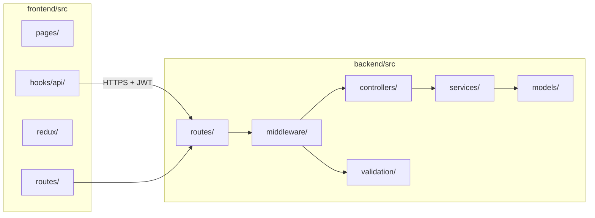

**Requirement traceability:** “Dashboard stat tiles” → `GET /cases/dashboard` → `CaseService.getDashboardStats` → `Case.countDocuments` filtered by role.

---

## 3. Backend router mount & middleware chain (logical)

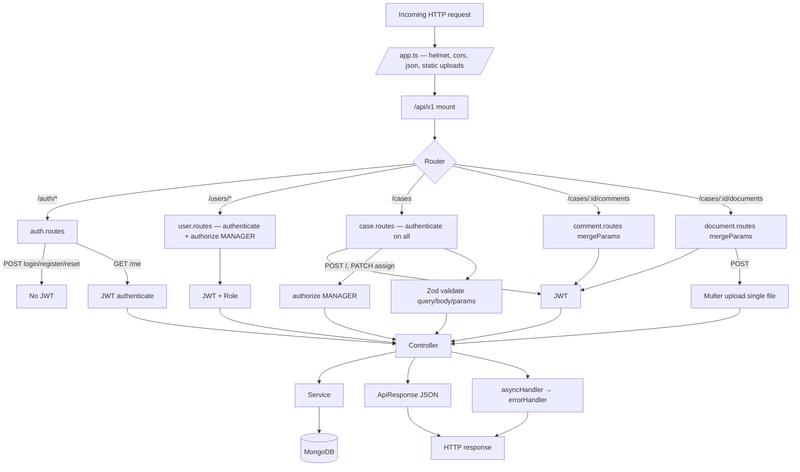

**Take-home alignment:** JWT + role-based access is enforced **before** controllers on protected branches; writes always pass **Zod** where configured.

---

## 4. Case status state machine (domain — server is source of truth)

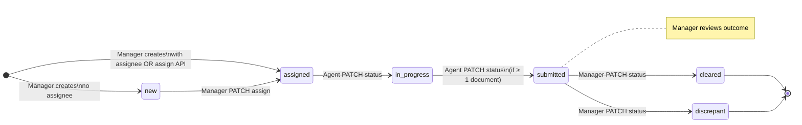

---

## 5. Sequence: login (JWT issuance)

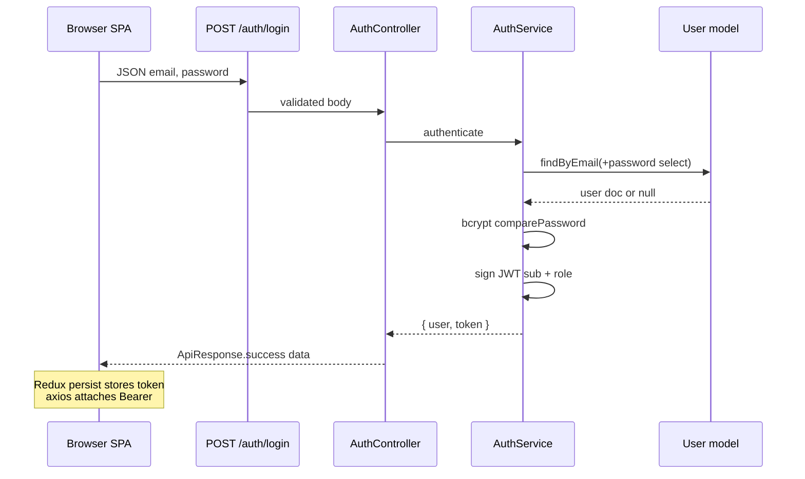

---

## 6. Sequence: list cases with filters & role scoping

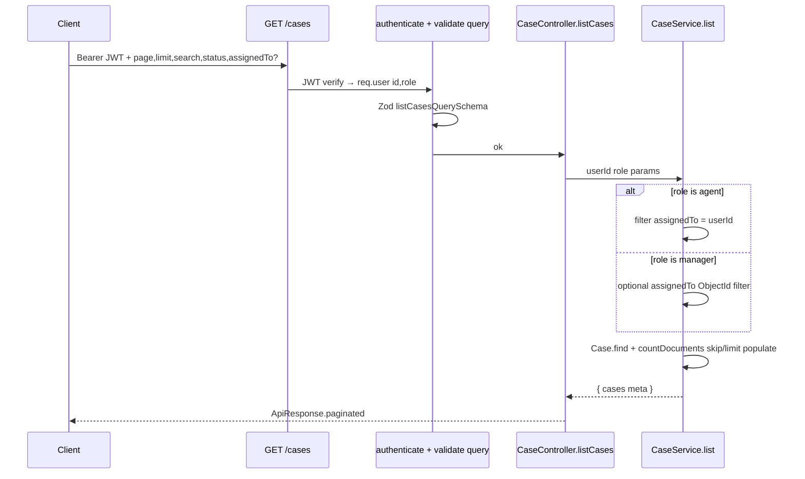

**Requirement:** “Agent sees only assigned cases” = **applied in service filter**, not UI-only.

---

## 7. Sequence: create case (manager) + audit

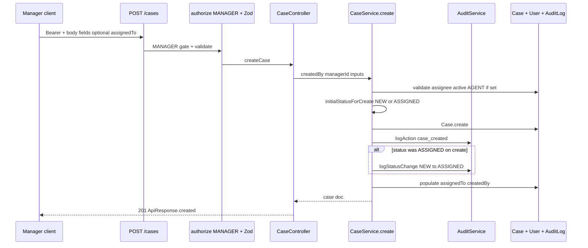

---

## 8. Sequence: PATCH status — agent submits (with document gate)

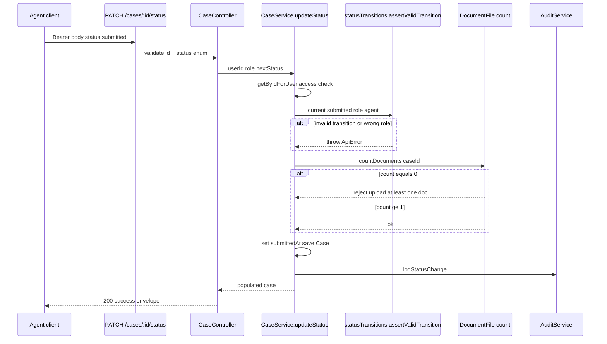

**Requirement:** “Submit requires ≥1 document” = **explicit check** before persistence.

---

## 9. Sequence: document upload (multipart)

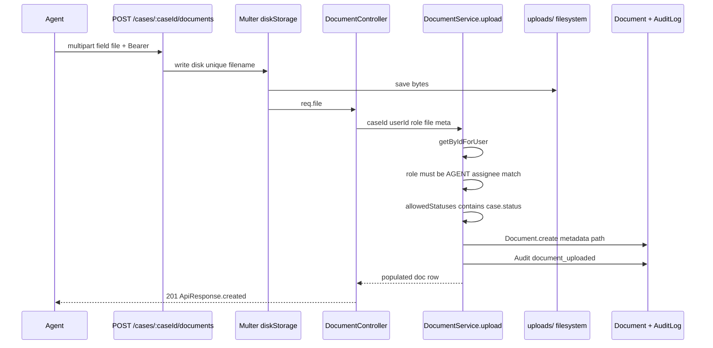

**Requirement:** File upload via **local storage** + **MIME allowlist** in `upload.middleware.ts`.

---

## 10. Sequence: add comment (closed case blocked)

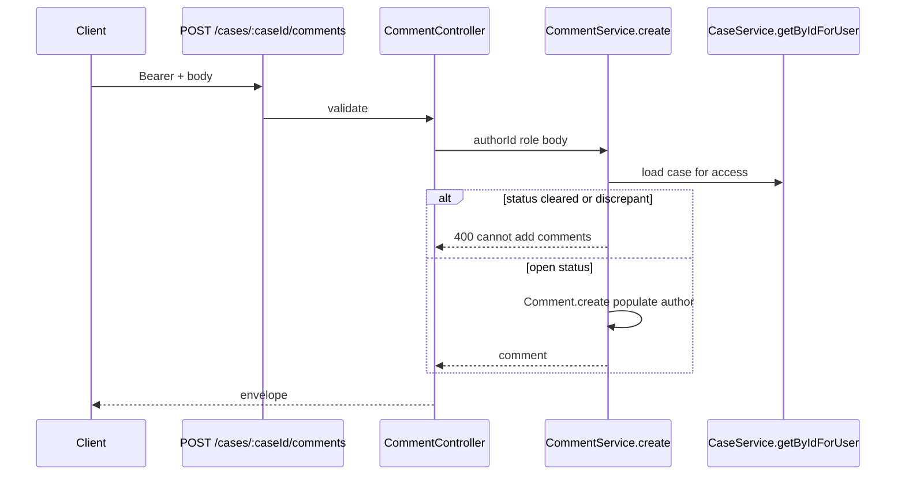

---

## 11. Frontend page → API → state (LLD view)

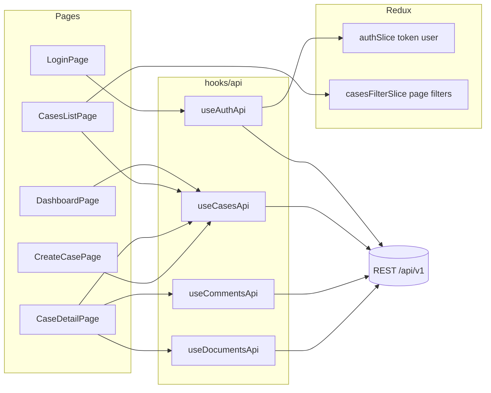

**Requirement:** “Custom API hooks per task” satisfied by **`hooks/api`** wrapping Axios with JWT from Redux.

---

## 12. Data persistence flows (conceptual writes)

High-level mapping of **which collections** absorb writes for primary user journeys:

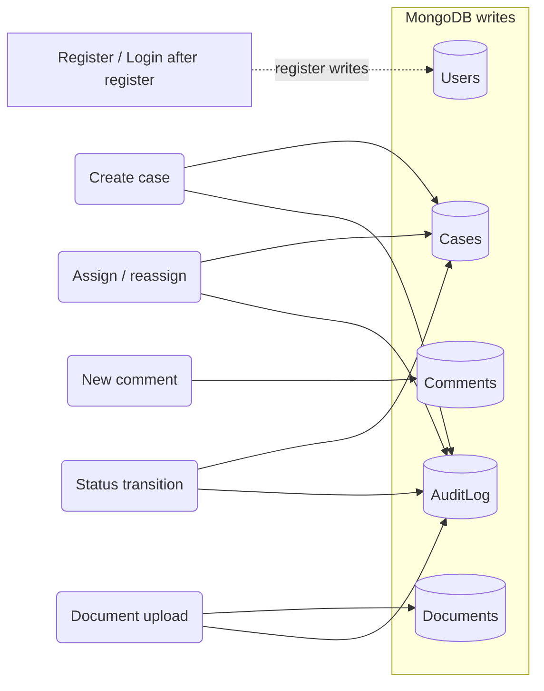

---

## 13. Error path (consistent failure envelope)

All controller paths use **`asyncHandler`**. Throws of **`ApiError`** map through **`errorHandler`** to JSON + HTTP status. Validation failures from Zod are normalized before responding.

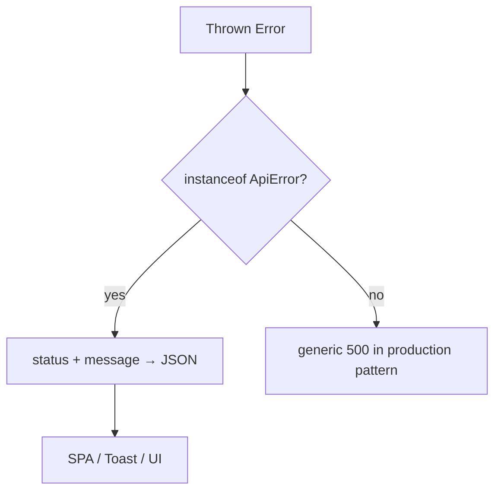

---

## 14. Reading order for “whole project + requirements”

1. **[01](./01-product-requirements-and-scope.md)** — what the take-home asks for vs what shipped.  
2. **[02](./02-system-architecture.md)** — where components live at deploy time.  
3. **This document (07)** — **how** calls flow through code and MongoDB for each story.  
4. **[04](./04-data-model-and-domain.md)** — field-level model and invariant reference.  
5. **[05](./05-api-and-integration.md)** — endpoint checklist for SPA and Swagger parity.  
6. **[06](./06-security-nfr-and-operations.md)** — threats, ops, secrets handling.

Keep **07** updated when routes, middleware order, or side-effect sequencing (audit before/after save) materially changes—those are the details interviewers probe.
