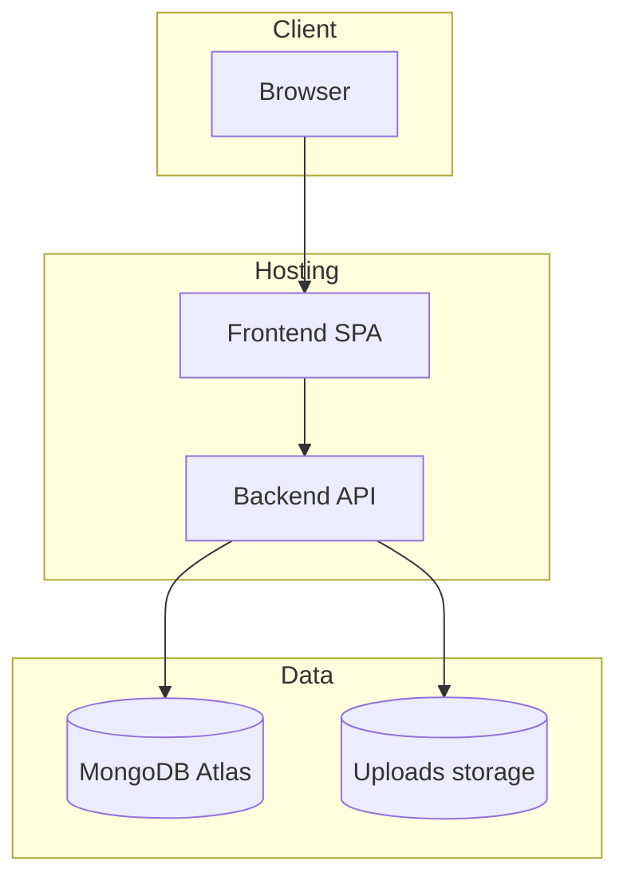
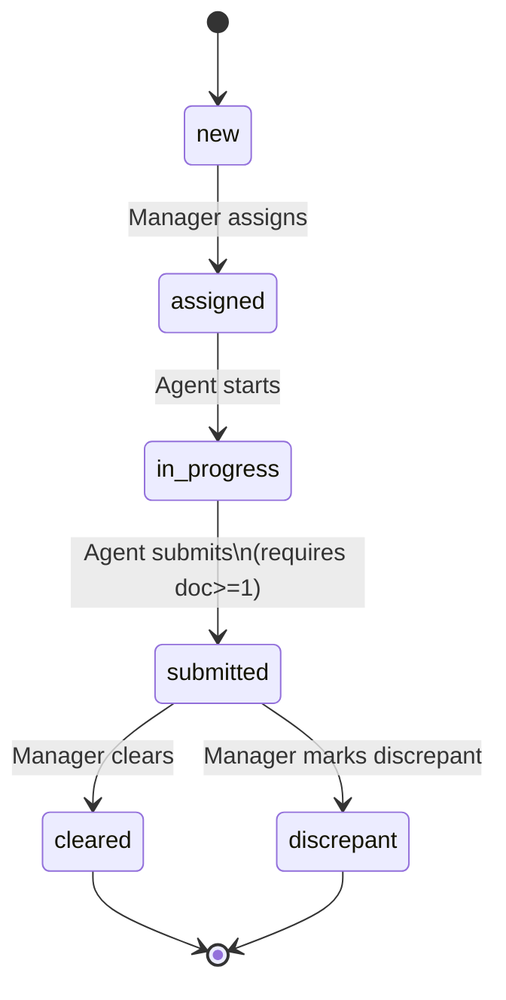

# Architecture — Mini Case Tracker (MERN)

This document explains the **overall architecture** and **how the system works end-to-end** in a simple way.

---

## 1) What problem this solves

Ops teams receive “cases” from clients. Each case must be assigned to an agent, worked on with documents and notes, then closed by a manager with a verdict.

The app replaces spreadsheets with a secure web workflow.

---

## 2) Main building blocks

- **Frontend (React + Vite + MUI)**: the web UI for Managers and Agents
- **Backend (Node + Express + TypeScript)**: REST API that enforces business rules
- **Database (MongoDB + Mongoose)**: stores users, cases, documents metadata, comments, audit log
- **File storage (local uploads)**: stores uploaded files on disk (metadata links stored in MongoDB)

---

## 3) System context (who talks to what)

```mermaid
flowchart LR
  U[Manager / Agent\n(Browser)] --> FE[Frontend SPA\nReact + MUI]
  FE -->|HTTPS JSON\nAuthorization: Bearer JWT| API[Backend API\nExpress + TS]
  API --> DB[(MongoDB)]
  API --> FS[(Local file storage\n/uploads)]
```

---

## 4) High-level deployment view

In development you run everything locally. In production it can be deployed as:

- **Frontend** on Vercel/Netlify
- **Backend** on Render/Railway/Fly.io
- **MongoDB** on MongoDB Atlas
- **Uploads**:
  - local disk is fine for take-home
  - for real production, move to object storage (S3/GCS) to avoid losing files on redeploy



---

## 5) Backend architecture (request → response)

Backend follows a layered flow:

1. **Routes** define endpoints and attach middleware.
2. **Middleware** enforces:
   - authentication (JWT)
   - authorization (role checks)
   - validation (Zod schemas)
3. **Controllers** call **services** and return a standard response envelope.
4. **Services** implement business rules and perform DB operations through models.
5. **Audit logging** records important state changes as an append-only timeline.

```mermaid
flowchart LR
  R[Route] --> M[Middleware\nJWT + Role + Validation]
  M --> C[Controller]
  C --> S[Service\nbusiness rules]
  S --> D[(MongoDB)]
  S --> A[AuditLog writes]
  C --> RESP[JSON Response\n{success,message,data,meta}]
```

---

## 6) Frontend architecture (how UI is organized)

Frontend is a single-page app:

- **Routing**:
  - Public: login/register/forgot/reset password
  - Protected: dashboard, cases list, case detail, (manager-only) create case
- **State**:
  - Redux stores auth token + user and UI state (theme, list filters)
  - API client attaches JWT to every request after login
- **Pages** call API via hook wrappers (e.g., cases/auth hooks) and display results using MUI components.

---

## 7) Data model (how data is stored)

Core collections:

- **User**: identity + role (`manager`/`agent`)
- **Case**: main workflow record (`status`, `assignedTo`, `createdBy`, due date, timestamps)
- **Document**: metadata for uploaded files (points to case + uploader + disk path)
- **Comment**: notes on a case (points to case + author)
- **AuditLog**: append-only timeline (status changes and important actions)

Full ER/schema diagram is in `docs/scehma.md`.

---

## 8) How the system works (end-to-end)

### A) Login (JWT auth)

1. User signs in with email/password.
2. Backend verifies credentials and returns a **JWT token** + user info.
3. Frontend stores token and sends it on each request as `Authorization: Bearer <token>`.

### B) Manager creates a case

1. Manager opens “New Case” and submits fields: client name, subject name, case type, due date.
2. Backend validates input and creates the case.
3. An **audit entry** is created (`case_created`).

### C) Manager assigns case to an agent

1. Manager selects an agent and assigns the case.
2. Backend ensures assignment is allowed and sets status to `assigned`.
3. Audit logs a `status_change` or `case_reassigned`.

### D) Agent works case (docs + comments) and submits

1. Agent sees only cases assigned to them.
2. Agent uploads documents/photos.
   - file saved to disk
   - metadata saved to MongoDB as `Document`
3. Agent adds comments/notes.
4. Agent submits the case:
   - backend enforces the workflow transition
   - backend enforces **submit requires at least one document**
   - audit records the status change

### E) Manager reviews and closes (Cleared/Discrepant)

1. Manager opens the submitted case.
2. Manager sets final status to `cleared` or `discrepant`.
3. Backend saves final state and audit entry.

---

## 9) Workflow status machine (source of truth: backend)



---

## 10) Key architecture rules (important for correctness)

- **Backend enforces all rules** (role checks, visibility, allowed status transitions, submit constraints).
- **Frontend improves UX** (hides buttons/options) but is not trusted for security.
- **AuditLog is append-only** and powers the timeline shown in the UI.
- **Search + pagination** are implemented server-side for performance and consistency.

For API details, see `docs/05-api-and-integration.md`. For design-level flows, see `docs/HLD.md` and `docs/LLD.md`.