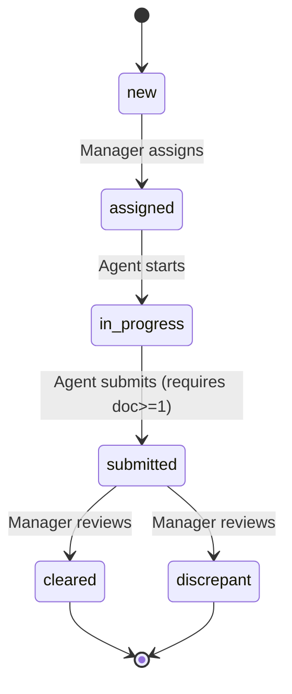
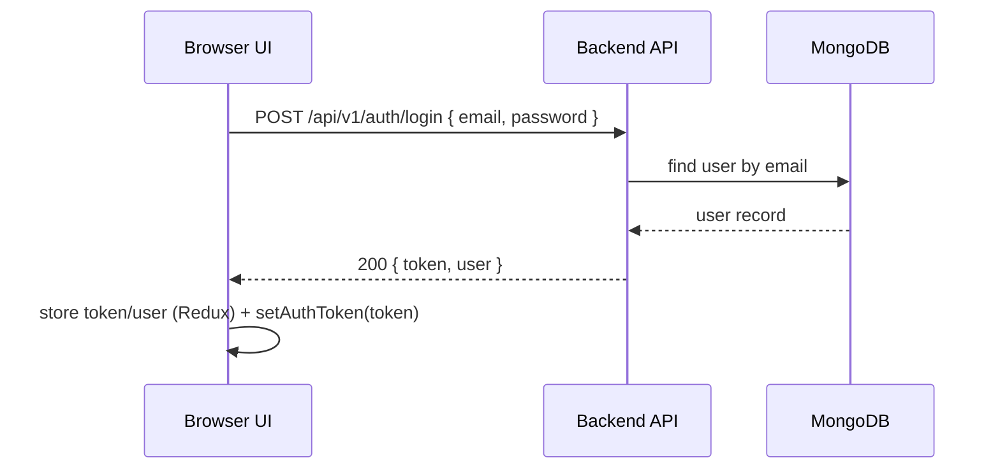
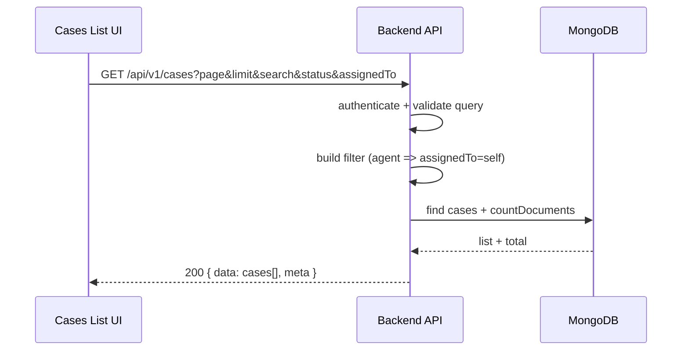
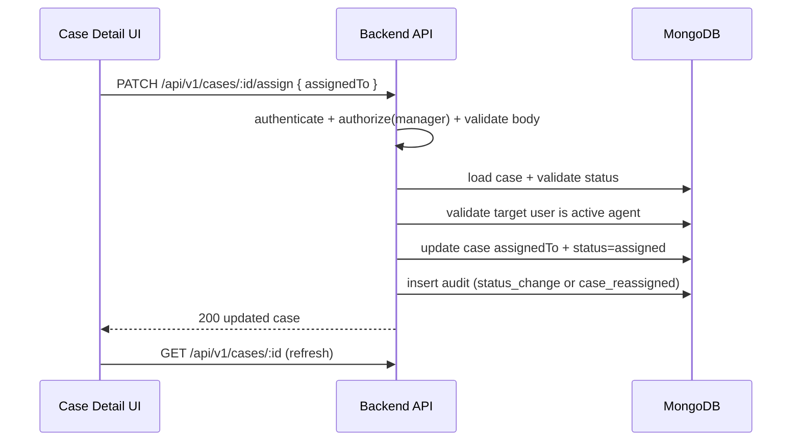
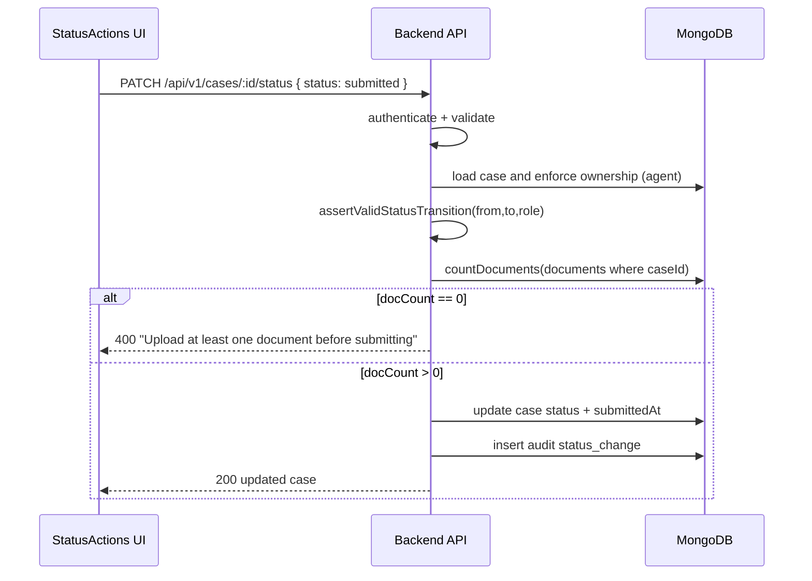

# Low Level Design (LLD) — Mini Case Tracker (MERN)

This LLD describes the **implementation-level** structure and runtime flows based on the current repository contents.

> Note: Some modules are referenced (e.g., auth/users/comments/documents services and models) but are not present in the current `backend/src` / `frontend/src` file list visible in this workspace snapshot. Where that occurs, this document marks them as **assumed** and aligns them with the existing HLD + `docs/04-data-model-and-domain.md` and `docs/05-api-and-integration.md`.

---

## 1) Backend LLD (Express + TypeScript)

### 1.1 Folder/module layout (as present)

- `backend/src/config/database.ts`
  - `connectDatabase()` / `disconnectDatabase()` using Mongoose
- `backend/src/routes/case.routes.ts`
  - case endpoints + OpenAPI annotations
  - middleware chaining: `authenticate` → `authorize` → `validate`
- `backend/src/controllers/case.controller.ts`
  - controller functions mapping HTTP → service calls → `ApiResponse.*`
- `backend/src/services/case.service.ts`
  - business logic for list/create/get detail/assign/status updates/dashboard/update/delete

### 1.2 Request pipeline (middleware chain)

For case routes, the effective pipeline is:

```mermaid
flowchart LR
  REQ[HTTP Request] --> AUTH[authenticate (JWT)]
  AUTH -->|401 if missing/invalid| ERR401[Error response]
  AUTH --> ROLE[authorize (role guard, when configured)]
  ROLE -->|403 if forbidden| ERR403[Error response]
  ROLE --> VAL[validate (Zod schema: body/query/params)]
  VAL -->|400 if invalid| ERR400[Error response]
  VAL --> CTRL[case.controller]
  CTRL --> SVC[case.service]
  SVC --> DB[(MongoDB via Mongoose)]
  SVC --> AUD[AuditService (append-only log)]
  SVC --> CTRL
  CTRL --> RES[ApiResponse envelope]
```

**Assumed modules** (referenced by imports in `case.routes.ts`):

- `middleware/auth.middleware.ts` → sets `req.user = { userId, role }`
- `middleware/role.middleware.ts` → `authorize(UserRole.MANAGER)` etc.
- `middleware/validate.middleware.ts` → applies Zod schemas
- `validation/case.validation.ts` → request schemas for cases
- `utils/ApiResponse`, `utils/ApiError`, `utils/asyncHandler`

### 1.3 Case routes (concrete)

Routes are defined in `backend/src/routes/case.routes.ts` under `router.use(authenticate)`:

- `GET /api/v1/cases`
  - query: `page`, `limit`, optional `search`, `status`, optional `assignedTo`
  - behavior:
    - **Manager**: sees all cases; may filter by `assignedTo`
    - **Agent**: sees only own assigned cases; ignores arbitrary `assignedTo`
- `GET /api/v1/cases/dashboard`
  - returns counts grouped by status (scoped for agent)
- `POST /api/v1/cases` (**Manager only**)
  - create case; optional `assignedTo` sets initial status `assigned`
- `GET /api/v1/cases/:id`
  - returns aggregated detail: `{ case, timeline, counts }`
- `PATCH /api/v1/cases/:id` (**Manager only**)
  - update case fields (tracked in audit as `case_updated`)
- `DELETE /api/v1/cases/:id` (**Manager only**)
  - removes case (and, by requirement, should cascade cleanup of documents/comments)
- `GET /api/v1/cases/:id/audit`
  - returns audit entries for a case (after access check)
- `PATCH /api/v1/cases/:id/assign` (**Manager only**)
  - assign/reassign case when status is `new` or `assigned`
- `PATCH /api/v1/cases/:id/status`
  - status transition with server-side enforcement:
    - agents: `assigned → in_progress → submitted`
    - managers: `submitted → cleared|discrepant`
    - submit requires at least 1 document

### 1.4 Case service functions (business rules)

#### `CaseService.list(params)`

- Builds Mongo filter:
  - if role is `agent` → `assignedTo = userId`
  - else (manager) optionally filters `assignedTo` when provided
  - optional `status`
  - optional `search` becomes `RegExp` OR across `clientName`, `subjectName`, `caseType`
- Executes:
  - `Case.find(filter).populate(assignedTo, createdBy).sort(updatedAt desc).skip().limit()`
  - `Case.countDocuments(filter)`
- Returns `{ cases, meta: { page, limit, total, totalPages } }`

#### `CaseService.create(input)`

- Validates optional `assignedTo`:
  - must be an active user with role `agent`
- Computes initial status using `initialStatusForCreate(assignedTo)`:
  - no assignee → `new`
  - with assignee → `assigned`
- Persists new `Case`
- Writes audit:
  - always `case_created`
  - if created as assigned: `status_change new → assigned` (with `assignedTo` in metadata)

#### `CaseService.getByIdForUser(caseId, userId, role)`

- Loads case by id
- Enforces access:
  - if role `agent`, `case.assignedTo` must match `userId`

#### `CaseService.getDetail(caseId, userId, role)`

- Calls `getByIdForUser` for access check
- Fetches in parallel:
  - populated case record
  - audit timeline (`AuditService.getByCaseId`)
  - comment count
  - document count
- Returns:
  - `{ case, timeline, counts: { comments, documents } }`

#### `CaseService.assign(caseId, managerId, assignedTo)`

- Allowed only when current status in `{ new, assigned }`
- Validates agent (active, role agent)
- Updates:
  - `assignedTo`, sets `status = assigned`
- Writes audit:
  - if `new → assigned`: `status_change`
  - else reassign: `case_reassigned` action with metadata

#### `CaseService.updateStatus(caseId, userId, role, nextStatus)`

- Loads case via `getByIdForUser` and captures `fromStatus`
- Enforces valid transition:
  - `assertValidStatusTransition(fromStatus, nextStatus, role)`
- Extra rule:
  - if `nextStatus == submitted`, require `Document.countDocuments({ caseId }) > 0`
  - sets `submittedAt`
  - if closing (`cleared`/`discrepant`) sets `reviewedAt`
- Updates status + saves
- Writes audit: `status_change from → to`

#### `CaseService.getDashboardStats(role, userId)`

- Filter:
  - agent: `assignedTo = userId`
  - manager: no filter
- Counts by each enum status (parallel)
- Returns `{ total, byStatus: [{ status, count }] }`

#### `CaseService.update(caseId, managerId, input)`

- Updates allowed fields (`clientName`, `subjectName`, `caseType`, `dueDate`)
- Builds a `changed` diff object and emits audit `case_updated` with metadata

#### `CaseService.remove(caseId, managerId)` (partial snippet visible)

- Deletes the case and writes audit `case_deleted`
- **Assumed**: also deletes comments/documents + filesystem files (per take-home requirement)

---

## 2) State machine enforcement (status transitions)

At runtime, status changes flow through:

`route → validate(body.status) → service.updateStatus() → assertValidStatusTransition() → persist → audit log`



---

## 3) Frontend LLD (React + MUI + Redux)

### 3.1 App composition

Top-level composition (`frontend/src/App.tsx`):

- Redux `Provider` + `PersistGate` (persisted auth/theme state)
- Theme provider: `AppThemeProvider` (MUI theme + app palette)
- Global error boundary + global toaster notifications
- Routes: `AppRoutes`

### 3.2 Routing and access guards

`frontend/src/routes/AppRoutes.tsx` defines:

- Public routes under `AuthLayout`:
  - login, register, forgot password (assumed page), reset password
- Protected area under `ProtectedRoute` + `MainLayout`:
  - dashboard (assumed page), cases list (assumed page), case detail, create case (manager only)

Guard behavior (`ProtectedRoute.tsx`):

- if not authenticated → redirect to login
- if `allowedRoles` is set and user role not included → redirect to dashboard

### 3.3 Redux slices (concrete)

#### Auth slice (`redux/slices/authSlice.ts`)

State:

- `token`
- `user` (role, name, email, id)
- `isAuthenticated`

Actions:

- `setCredentials({ token, user })`
  - stores token + user, sets `isAuthenticated=true`
  - calls `setAuthToken(token)` in the API client (assumed: axios interceptor/header setter)
- `logout()`
  - clears token in API client + resets state

#### Cases filter slice (`redux/slices/casesFilterSlice.ts`)

State: `search`, `status`, `assignedTo`, `page`, `limit`

Actions: `setSearch`, `setStatus`, `setAssignedTo`, `setPage`, `resetFilters`

### 3.4 API hooks (concrete)

#### `useAuthApi` (`hooks/api/useAuthApi.ts`)

- `login(credentials)` → `POST /auth/login` → returns `{ token, user }`
- `register(credentials)` → `POST /auth/register` → returns `{ token, user }`
- `forgotPassword(payload)` → `POST /auth/forgot-password` (assumed backend route)
- `resetPassword(payload)` → `POST /auth/reset-password` (assumed backend route)
- `getMe()` → `GET /auth/me` (assumed backend route)

#### `useCasesApi` (`hooks/api/useCasesApi.ts`)

- `listCases(params)` → `GET /cases` (returns `{ cases, meta }`)
- `getCase(id)` → `GET /cases/:id` (returns `{ case, timeline, counts }`)
- `createCase(payload)` → `POST /cases`
- `assignCase(id, payload)` → `PATCH /cases/:id/assign`
- `updateStatus(id, payload)` → `PATCH /cases/:id/status`
- `updateCase(id, payload)` → `PATCH /cases/:id`
- `deleteCase(id)` → `DELETE /cases/:id`
- `getDashboard()` → `GET /cases/dashboard`

### 3.5 Case detail page flow (concrete)

`frontend/src/pages/cases/detail/CaseDetailPage.tsx` orchestrates:

- Loads on mount:
  - case detail (`GET /cases/:id`)
  - comments list (assumed API hook)
  - documents list (assumed API hook)
  - if manager: agents list (assumed API hook)
- Renders:
  - header + status chip
  - `StatusActions` to drive transitions / assignment
  - `StatusTimeline` fed by audit entries
  - `CommentsSection` (disabled when case is closed)
  - `DocumentsSection` (upload/delete allowed only when agent is assigned and case not closed)

### 3.6 UX-level enforcement vs server enforcement

Frontend computes:

- `closed = isCaseClosed(status)` (cleared/discrepant)
- `isAssignedAgent` (user.role is agent AND case.assignedTo matches user id)

and gates:

- upload/delete doc buttons
- comment actions
- available next statuses (via `getNextStatuses(...)` in `utils/statusHelpers.ts`)

Backend still enforces the canonical rules; frontend gating is for a better UX.

---

## 4) Key sequence diagrams

### 4.1 Login and bootstrap



### 4.2 List cases (role-scoped)



### 4.3 Assign case (manager)



### 4.4 Update status with submit constraint



---

## 5) Implementation notes / assumptions to reconcile

If you want this LLD to perfectly match the repo, ensure the workspace includes these referenced modules (or add them):

- Backend: auth routes, user routes (`/users/agents`), comments/documents nested routes, audit service, Mongoose models, upload handling (multer)
- Frontend: cases list page, dashboard page, create case page, comments/documents/users API hooks and components

The existing `docs/04-data-model-and-domain.md` and `docs/05-api-and-integration.md` already document those missing pieces; this LLD keeps the same contract and describes the concrete flows implemented in the case module.