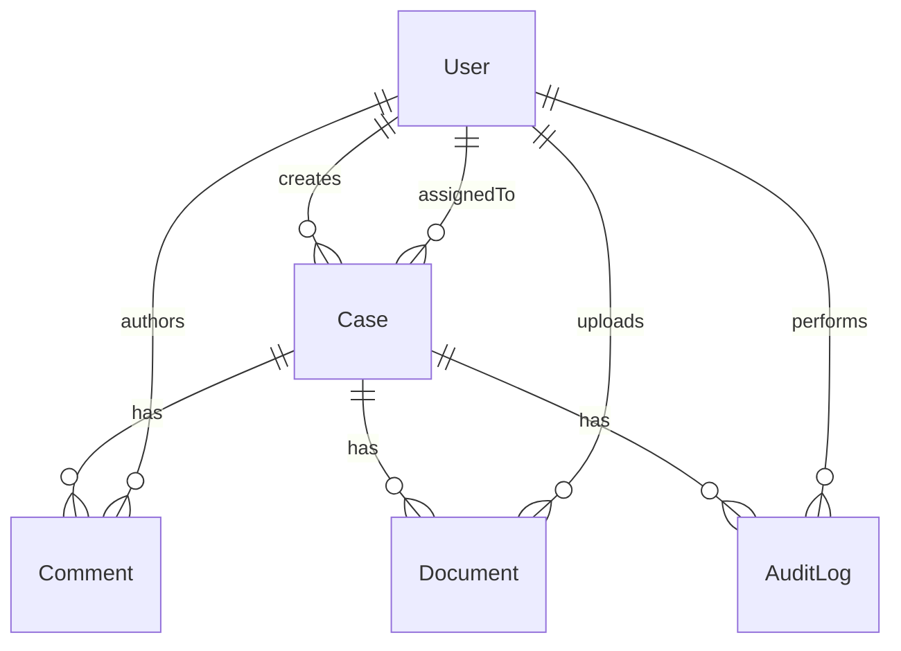
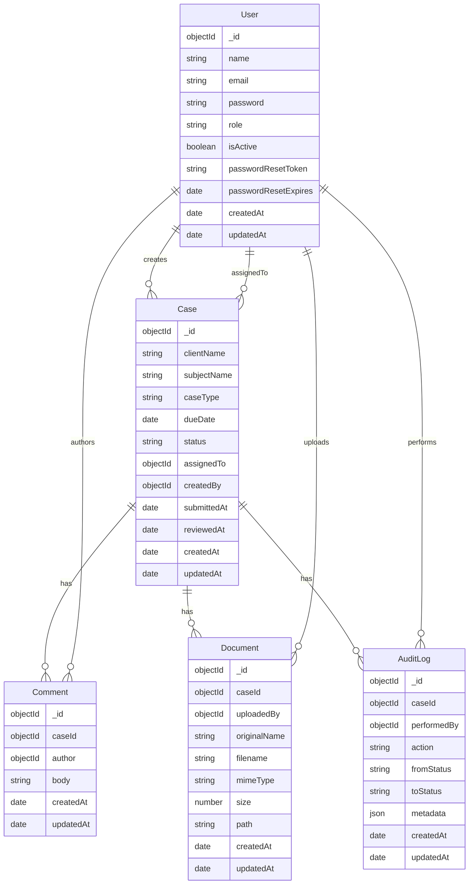

# Schema / ER Diagram — Mini Case Tracker (MongoDB + Mongoose)

This document is generated from the Mongoose models under `backend/src/models`.

---

## 1) Entities (collections) and relationships

### Relationship summary

- **User** creates many **Case** records (`Case.createdBy → User`)
- **User** is assigned many **Case** records (`Case.assignedTo → User`)
- **Case** has many **Comment** (`Comment.caseId → Case`)
- **Comment** authored by **User** (`Comment.author → User`)
- **Case** has many **Document** (`Document.caseId → Case`)
- **Document** uploaded by **User** (`Document.uploadedBy → User`)
- **Case** has many **AuditLog** entries (`AuditLog.caseId → Case`)
- **AuditLog** performed by **User** (`AuditLog.performedBy → User`)

---

## 2) ER diagram (conceptual)

---

## 3) Collection schema diagram (major fields)

---

## 4) Model-by-model notes (from code)

### `User` (`backend/src/models/User.ts`)

- `email` is **unique** and normalized (lowercase + trim).
- `password` is stored hashed (bcrypt) and **excluded by default** (`select: false`).
- `passwordResetToken` / `passwordResetExpires` are also **excluded by default**.
- `role` is an enum: `manager` / `agent` (from `utils/constants`).
- `isActive` defaults to `true`.

### `Case` (`backend/src/models/Case.ts`)

- Fields: `clientName`, `subjectName`, `caseType`, `dueDate`, `status`, `assignedTo`, `createdBy`.
- Optional timestamps:
  - `submittedAt` set when agent submits
  - `reviewedAt` set when manager closes as cleared/discrepant
- Indexes:
  - compound `{ status: 1, assignedTo: 1 }` (fast filtered lists)
  - text index on `clientName`, `subjectName`, `caseType` (search)

### `Comment` (`backend/src/models/Comment.ts`)

- `caseId` references `Case`
- `author` references `User`
- `body` max length **5000**
- Index: `{ caseId: 1, createdAt: -1 }` (timeline order per case)

### `Document` (`backend/src/models/Document.ts`)

Model name is registered as **`Document`** via:

- `mongoose.model('Document', documentSchema)`

Fields include `originalName`, stored `filename`, MIME, size, and file `path`.

Index: `{ caseId: 1 }`

### `AuditLog` (`backend/src/models/AuditLog.ts`)

- Designed as an append-only event stream per case.
- `action` is required (examples in services: `case_created`, `case_updated`, `case_reassigned`, `status_change`).
- `fromStatus` / `toStatus` are enums (optional depending on action).
- `metadata` is flexible (`Mixed`) to store contextual details.
- Index: `{ caseId: 1, createdAt: -1 }`
